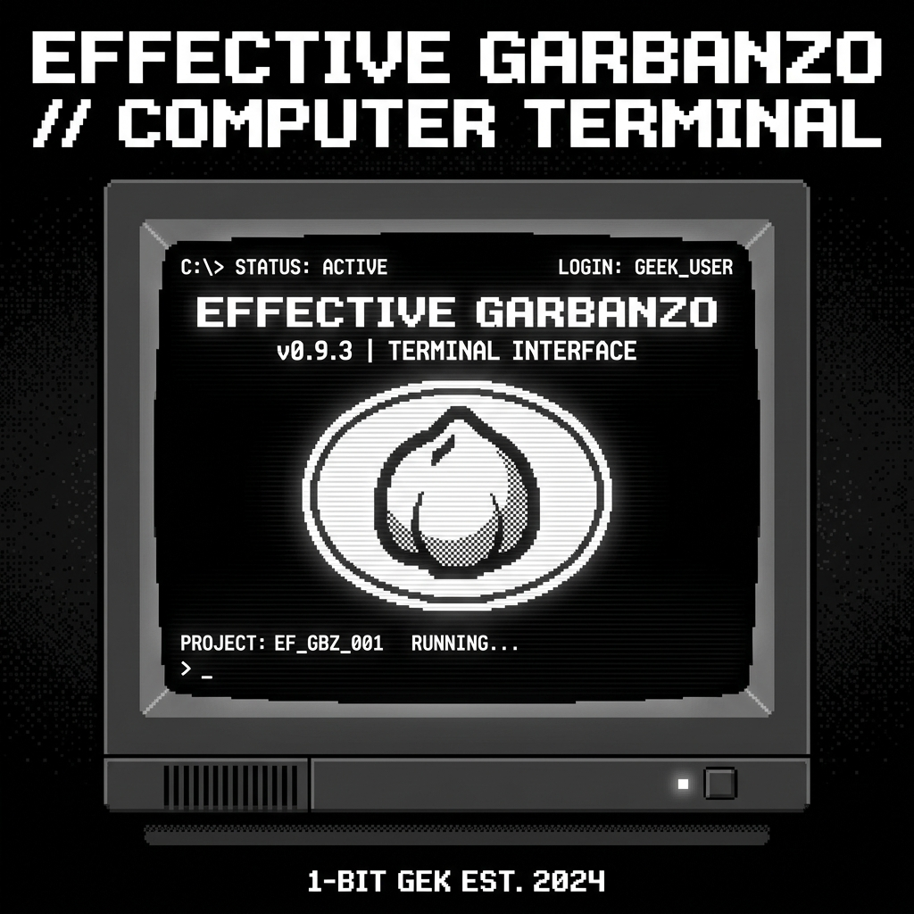

<p align="center">
  
</p>

<p align="center">
  <strong>简体中文</strong>
  &nbsp;·&nbsp;
  <a href="./docs/instructions.md">设计指南</a>
  &nbsp;·&nbsp;
  <a href="./docs/career_page_analysis.md">视觉分析报告</a>
</p>

<p align="center">
  <a href="./LICENSE"></a>
  <a href="https://github.com/curapima/effective-garbanzo/stargazers"></a>
  <a href="https://vercel.com"></a>
</p>

<br/>

<h3 align="center">Effective Garbanzo</h3>
<p align="center">层级化黑白极客风格的个人知识终端与博客。基于 Next.js、TypeScript 与 Tailwind CSS 构建，集成了 1-Bit 复古美学、开机光栅与硬件 LED 交互动效。</p>

<br/>

> [!IMPORTANT]
> **本地开发使用 pnpm**：本项目采用 `pnpm` 作为依赖管理工具。在运行本地开发命令前，请确保您已安装 `pnpm`。

<br/>

## 🎯 视觉与交互特色

### 1-Bit 极客黑白主题（层次化白底黑字）
- **禁止自动暗色模式**：结合 HTML Viewport metadata、CSS `color-scheme: light !important`、`forced-color-adjust: none !important` 以及 Dark Reader 插件官方认可的 `<meta name="darkreader-lock">` 标签，全面封锁并防御任何浏览器或插件的强制颜色反转，保障排版在任何模式下均有稳定的表现。
- **灰白立体层次**：采用极浅灰（`#f5f5f7`）网页底色配合纯白（`#ffffff`）的卡片和屏幕视图，使设备和内容面板轮廓清晰、自然剥离。
- **字色梯度**：主标题为 stark 纯黑（`#000000`），正文为深炭灰（`#3a3a3c`），元数据为中深灰（`#5c5c5e`），在单色基调下建立极佳的高清度对比和阅读结构层次。

### 拟物硬件 LED 交互状态反馈灯
屏幕右下角的三盏圆形 LED 控制灯是完全响应操作的交互反馈器：
- **第一盏灯 🟢 (Scroll Sync)**：滚动网页或滑动滚轮时自动亮起为黑色，停止滚动 `300ms` 后熄灭，反馈数据流位移。
- **第二盏灯 🟢 (Input Activity)**：在页面任意位置点击鼠标时触发，以 `120ms` 的高频随机波动闪烁 `400ms`，模拟键盘/鼠标输入的数据信号读取。
- **第三盏灯 🟡 (Route Loading)**：切换路由（页面跳转）时触发，呈黑色并规律性等频慢速闪烁 `1.2秒` 后熄灭，模拟硬件信道寻址过程。
- 顶部电源绿灯支持缓慢的呼吸发光（`led-breathe`），赋予终端安静运行的质感。

### CRT 电子枪开机光栅展开动效
- 首次访问网站或载入页面时，屏幕显示会执行经典的 CRT 显像管开机波线展开动画。
- 利用 `sessionStorage` 会话缓存机制**锁定单次运行**：只有首次开机触发，之后站内切换页面时常亮，避免频繁折叠造成的视觉混乱。
- 配合延时显像过滤，内容仅在屏幕完全水平铺满时瞬间显现，防止了文字拉伸挤压造成的畸变闪烁。

### 终端打字机特效
- 新增了 `<TypewriterText>` 自定义组件，使首页大标题、子频道标题、文章标题在载入时像控制台读取数据般逐字打出，并在末尾显示可闪烁呼吸的像素方块光标 `█`，打字完成后光标隐退。

---

## 🛠️ 技术栈与字体

- **包管理器**：pnpm
- **应用框架**：Next.js (App Router)
- **语言**：TypeScript
- **样式方案**：Tailwind CSS
- **渲染方案**：Three.js (预留硬件渲染)
- **内容渲染**：Markdown / MDX (基于 `react-markdown` + `remark-gfm`)
- **内容管理**：Keystatic（本地可视化编辑 `content/posts/*.md`）
- **图标**：Lucide React
- **字体**：
  - UI 标签、标题、导航和数字使用本地托管的 `Fusion Pixel 12px Monospaced` 像素字体。
  - 字体文件位于 `public/fonts/fusion-pixel/`，许可证文件保留在同一目录。
  - 正文继续使用系统无衬线字体，以确保长文阅读体验。

---

## 📦 本地开发与常用脚本

### 安装依赖

```bash
pnpm install
```

### 运行开发服务器

```bash
pnpm dev
```
打开 [http://localhost:3000](http://localhost:3000) 即可在本地访问站点。

本地内容后台入口：

```text
http://localhost:3000/keystatic
```

Keystatic 会直接读写仓库中的 `content/posts/*.md` 文件。若 `3000` 端口已被占用，可使用 Next.js 提示的备用端口，或显式指定端口运行：

```bash
pnpm dev -- --port 3001
```

### 生产环境打包与运行

```bash
pnpm build  # 打包
pnpm start  # 运行生产包
```

## ✍️ 撰写与更新文章

所有博客文章都存放在 [`content/posts/`](./content/posts/) 目录，支持 `.md` 和 `.mdx` 格式。您可以选择使用可视化后台或本地手写方式更新博客。

### 💡 Keystatic 可视化后台（推荐）
项目已接入 **Keystatic**，用于管理文章 frontmatter 与 Markdown 正文：
1. 本地启动开发服务器：`pnpm dev`。
2. 浏览器访问：`http://localhost:3000/keystatic`。
3. 进入 `文章列表`，新增或编辑文章。
4. 点击 `Save` 后，Keystatic 会直接写回 `content/posts/*.md`。

> [!NOTE]
> 当前 Keystatic 配置使用 `fields.mdx({ extension: "md" })` 编辑 Markdown 正文。Next.js 15 开发模式下，Keystatic 编辑器曾触发过一条内部 `href=""` 控制台提示；项目已在 Keystatic 页面内精确过滤该提示，不影响其他错误输出。

---

### 💻 本地传统更新流程


### 1. 快捷创建草稿
您可以使用内置的命令行命令在本地快速生成带有 frontmatter 预设的草稿文件：
```bash
pnpm new:post -- "文章标题" --category=分类名称 --tags=标签1,标签2
```
该脚本会自动在 `content/posts/` 目录下生成一个对应的 `.md` 文件，其 frontmatter 默认将 `draft` 标记为 `true`。

### 2. 撰写与元数据配置 (Frontmatter)
打开生成的 Markdown 文件，在顶部的 YAML Frontmatter 区域进行元数据配置：
```yaml
---
title: "您的文章标题"
description: "文章的简短摘要，将展示在列表页并用于 SEO 优化。"
date: "2026-06-19"       # 首次发布日期 (YYYY-MM-DD)
updated: "2026-06-19"    # 修改更新日期 (YYYY-MM-DD)
category: "技术"         # 单个主分类（自动在 /categories 页面聚合）
tags:                    # 标签列表（自动在 /tags 页面分类）
  - "Next.js"
  - "前端"
draft: false             # 设置为 false 代表正式发布，设置为 true 代表隐藏草稿
---
```
在三条短横线 `---` 下方，直接使用标准的 Markdown 语法编写您的正文内容即可。
> [!NOTE]
> 文件的英文文件名将自动作为该文章在网站的访问路径，例如 `content/posts/hello-world.md` 的 URL 为 `/posts/hello-world`。
>
> Keystatic 保存 YAML 时可能会将日期写成不带引号的 `2026-06-19`。读取逻辑已兼容字符串日期与 YAML 原生日期，并统一归一化为 `YYYY-MM-DD`。

### 3. 插入本地图片
若要在博客文章中引用本地图片：
1. 请将图片文件存放在 `public/images/posts/` 目录下（如目录不存在，请手动创建）。
2. 在 Markdown 文章中通过绝对路径引入图片，例如：
   ```markdown
   
   ```

### 4. 提交并部署发布 (Git & Vercel)
当您完成文章撰写，并将 `draft` 改为 `false` 后，只需通过 Git 推送至 GitHub，即可触发 Vercel 的 CI/CD 自动部署：
```bash
git add .
git commit -m "feat: publish new article"
git push origin main
```
部署完成后（通常仅需 1-2 分钟），新文章将自动在主站完成静态导出并全网实时上线。更完整的上传说明详见 [`content/README.md`](./content/README.md)。

---

## 📂 主要目录

```text
├── content/               # 博客文章 MD/MDX 内容源文件
│   └── posts/             # 存放所有 Markdown 格式的文章
├── docs/                  # 存放项目规划与分析等设计文档
│   ├── career_page_analysis.md  # 视觉与技术栈分析报告
│   └── instructions.md         # 博客网站构建与设计规范说明
├── public/                # 存放静态资源
│   ├── fonts/             # 托管 Fusion Pixel 像素字体
│   └── images/            # 静态图片资源 (含项目 Banner)
├── scripts/               # 本地开发辅助脚本
│   └── new-post.mjs       # 快捷新建文章草稿的 Node.js 脚本
├── src/                   # Next.js 应用程序源码
│   ├── app/               # App Router 路由与页面布局
│   │   ├── api/keystatic/ # Keystatic 本地/远程内容 API
│   │   ├── about/         # 关于页面
│   │   ├── categories/    # 分类聚合页面
│   │   ├── keystatic/     # Keystatic 可视化后台页面
│   │   ├── posts/         # 文章阅读详情页面
│   │   ├── tags/          # 标签聚合页面
│   │   ├── globals.css    # 全局样式（含 1-Bit 极客黑白主题和 CRT 动画）
│   │   ├── layout.tsx     # 全局主页面框架和 DarkReader 强制锁定配置
│   │   ├── page.tsx       # 首页（集成 CRT 显示器及三色 LED 反馈灯）
│   │   ├── robots.ts      # SEO 自动生成的 robots.txt 路由
│   │   ├── rss.xml/       # 自动生成的 RSS 订阅路由
│   │   └── sitemap.ts     # SEO 自动生成的站点地图路由
│   ├── components/        # 像素风与极客交互 UI 组件
│   │   ├── layout/        # 页面布局组件（如 ScreenFrame.tsx 硬件外壳）
│   │   ├── post/          # 博客文章渲染与列表展示组件
│   │   ├── LinkPanel.tsx  # 侧边/底部链接导航面板
│   │   └── TypewriterText.tsx  # 终端光标打字机效果组件
│   └── lib/               # 业务逻辑与工具函数
│       ├── posts.ts       # 本地 Markdown 解析和元数据读取逻辑
│       └── site.ts        # 站点全局常量配置
├── tests/                 # 预留自动化测试目录
├── keystatic.config.ts    # Keystatic 内容模型与存储配置
├── tailwind.config.ts     # Tailwind CSS 配置文件
└── tsconfig.json          # TypeScript 配置文件
```

---

## 🚀 部署至 Vercel

本项目经过优化，可以无缝部署到 **Vercel** 托管平台。建议将项目的 GitHub 仓库直接连接到 Vercel，实现自动部署和持续集成（CI/CD）。

### 部署详细步骤：

1. **推送代码至 GitHub**：
   * 确保你已在本地将代码提交并推送（`git push`）到你的 GitHub 远程仓库中。

2. **登录 Vercel**：
   * 访问 [Vercel 官网 (vercel.com)](https://vercel.com/)。
   * 推荐点击 **"Continue with GitHub"**，直接使用你的 GitHub 账号进行登录或注册，以便于快速读取你的代码仓库列表。

3. **导入项目 (Import Project)**：
   * 登录后进入 Vercel 仪表盘 (Dashboard)，点击右上角的 **"Add New..."** 按钮，选择 **"Project"**。
   * 在 **"Import Git Repository"** 列表中，你会看到你 GitHub 账号下的仓库。
   * 找到本仓库（例如 `effective-garbanzo`），点击其右侧的 **"Import"** 按钮。

4. **配置项目设定 (Configure Project)**：
   * **Framework Preset（框架预设）**：确认 Vercel 自动识别并选定为 **Next.js**。
   * **Root Directory（项目根目录）**：保持默认的 `./`（即项目根路径）。
   * **Build & Development Settings**：保持默认配置。Vercel 会检测到 `pnpm-lock.yaml` 并自动使用 `pnpm` 进行依赖安装和打包。
   * **Environment Variables（配置环境变量）**：
     * 展开 "Environment Variables" 折叠面板。
     * 添加 Key 为 `NEXT_PUBLIC_SITE_URL`，Value 为你的自定义域名（例如 `https://your-domain.com`，如果没有自定义域名，也可以在后续绑定分配给你的 `*.vercel.app` 域名）。
     * *该变量极为重要，将自动被编译注入到网站的 metadata、RSS 订阅源、Sitemap 和 robots 协议中的绝对链接中。*
     * 如需在生产环境使用 Keystatic 写入 GitHub，请同时配置 `KEYSTATIC_GITHUB_CLIENT_ID`、`KEYSTATIC_GITHUB_CLIENT_SECRET` 与 `KEYSTATIC_SECRET`，并确保 GitHub App 对仓库拥有写入权限。未配置时，生产站点仍可正常读取已提交的 Markdown 内容。

5. **执行部署 (Deploy)**：
   * 配置完成后，点击底部的 **"Deploy"** 按钮。
   * Vercel 会自动拉取你的 GitHub 仓库代码、安装依赖、并执行静态页面构建。
   * 约 1-2 分钟编译完成后，会显示成功的预览屏幕与烟花动画。

### 自动化构建 (CI/CD)：
- **主分支部署**：项目绑定成功后，每当你向 GitHub 上的 `main` (或 `master`) 分支推送代码（`git push`），Vercel 都会自动触发重新打包构建，并在几分钟内实现全自动的在线更新上线。
- **Preview 预览部署**：如果你推送代码到非主分支（例如新建功能分支），Vercel 会为你生成一个独立的临时预览地址，便于在合并代码到主分支前在线预览和检查效果。

---

<p align="center">
  <sub>MIT — see <a href="./LICENSE">LICENSE</a></sub>
  <br/>
  <sub>Built with 🖤 by the community at <a href="https://github.com/curapima/effective-garbanzo">curapima/effective-garbanzo</a></sub>
</p>
