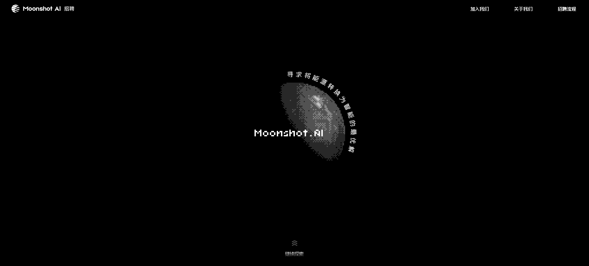
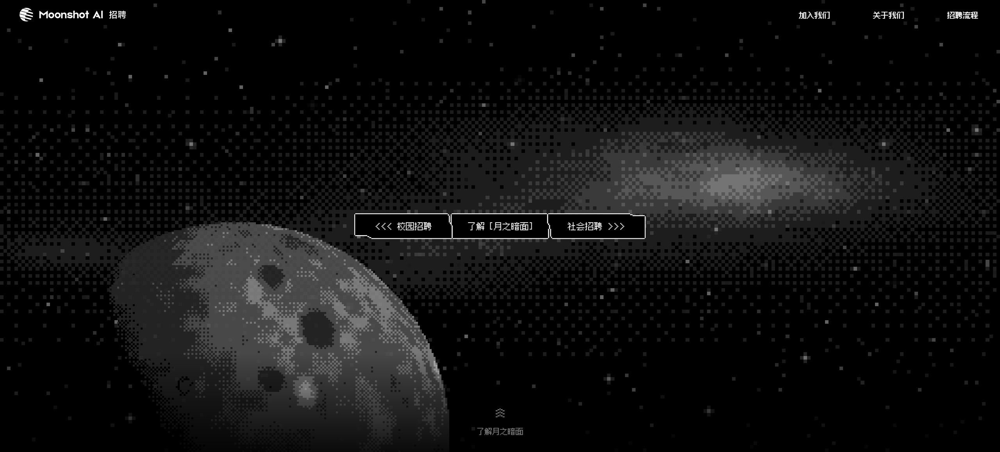
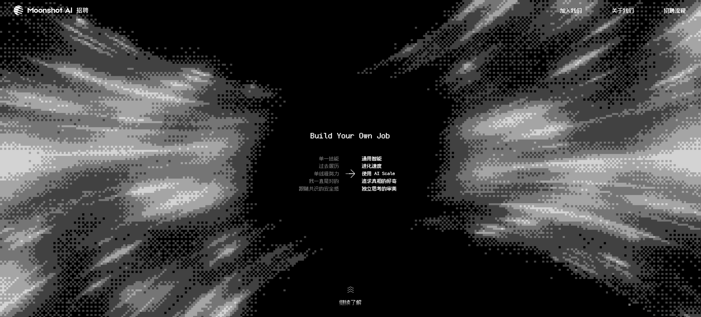
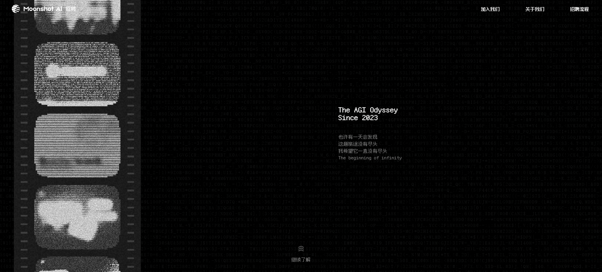
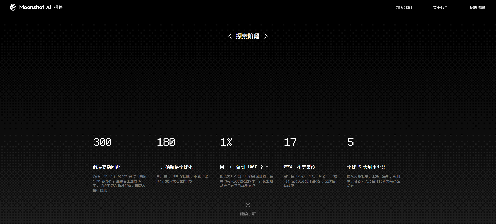
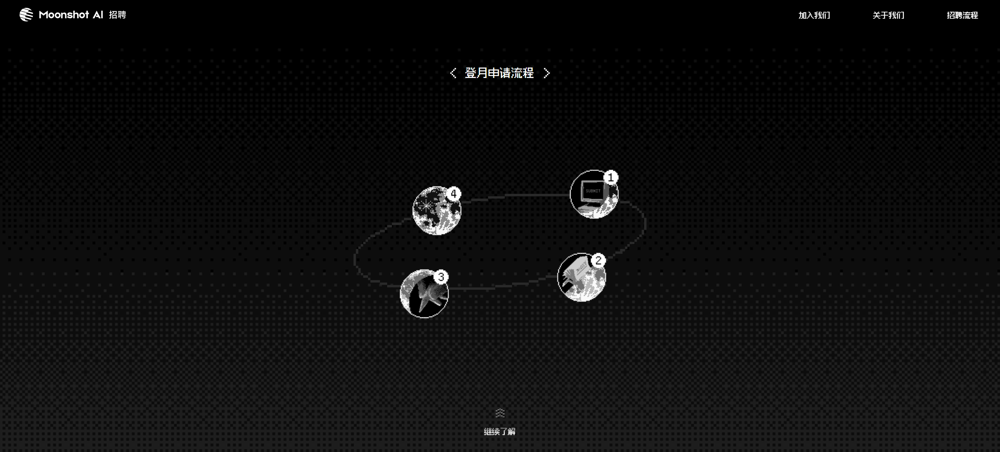
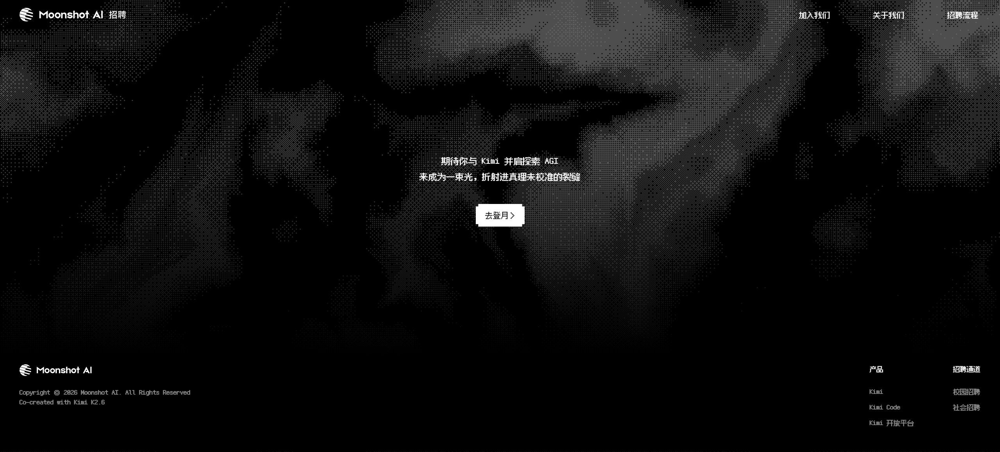
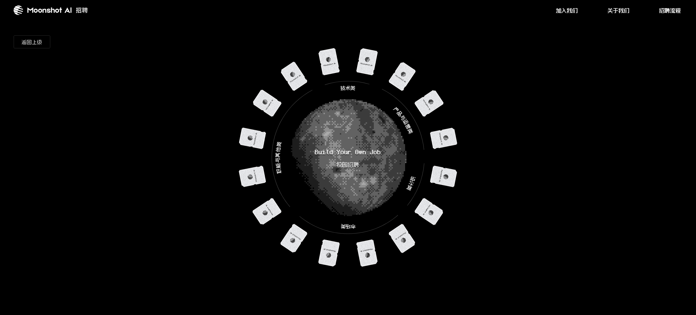
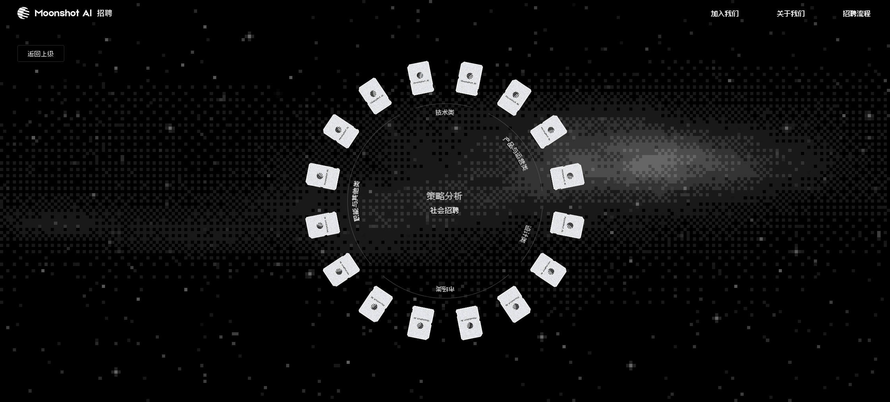

# Moonshot AI (月之暗面) 招聘官网视觉、主题及技术栈分析报告

本报告对月之暗面（Moonshot AI）官方招聘网站（https://careers.kimi.com/）的设计主题、视觉艺术风格、交互逻辑以及前端底层技术栈进行了深入的拆解与分析。

---

## 🎨 2. 视觉设计与艺术风格 (Visual Design & Art Style)

* **色彩方案**：**极致黑白灰单色调 (Monochromatic Greyscale)**
  纯黑背景、纯白文字与不同深浅的灰色元素。完全摒弃鲜艳色彩，契合“月之暗面”的品牌调性，传达出沉静、冷峻且充满智性的极客美学。
* **艺术流派**：**复古 8-bit 与像素风 (Retro 8-bit & Pixel Art)**
  * 网页中的关键视觉元素（旋转月球、星空星系、卡片、状态边框）均使用低分辨率的像素画风渲染。
  * 融入了早期终端绿色扫描线、CRT 显示器白噪音/静电雪花屏以及类似黑客帝国的终端代码雨动效，向早期计算机硬核文化致敬。
* **排版字体**：
  * **开源像素字体**：网页内所有 8-bit/像素风的标题、英文及数据数字，均使用由国内开发者开源的像素字体 **`Fusion Pixel 12px Mono zh_hans`** (缝合像素字体)。
  * **常规正文字体**：中文和英文正文则采用系统高可读性无衬线字体组合 (`ui-sans-serif, system-ui, sans-serif`)，以确保招聘岗位的文字阅读体验。

---

## 🛠️ 3. 技术栈与开源组件库分析 (Technology Stack & Frontend Analysis)

通过对打包的脚本和样式表进行特征扫描，该网站在前端实现上采用了以下技术方案：

* **应用框架**：**Next.js (React)** 
  采用 Next.js App Router 架构搭建，构建工具启用了 **Turbopack**（在静态 JS 模块中检测到大量的 `turbopack` 特征）。
* **样式框架**：**Tailwind CSS**
  使用 Tailwind CSS 原子类控制基础布局和自适应排版。CSS 样式表中含有大量 Tailwind 特有的 `--tw-` 变量，且多处使用了如 `h-svh`（视口高度）、`overflow-hidden`、`bg-black` 等工具类。
* **动画引擎**：**GSAP (GreenSock Animation Platform)**
  在核心动画包（如 `88f5b3446286ecaa.js`）中检测到大量的 GSAP 物理与时间轴控制动效。整个网站流畅的段落切换、滚动阻尼感、星空线条穿梭以及元素交互动效均由 GSAP 驱动。
* **UI 组件库**：**无现成第三方 UI 库**
  经全面检索，代码中未引入类似 Ant Design、MUI 或 Radix UI 等第三方 UI 组件库。为了配合 8-bit 像素主题，网页中的环形芯片选择器、像素弹窗、拟物卡片等组件均基于 Tailwind CSS 和 React 原生手写实现。
* **渲染技术**：使用 HTML5 **Canvas** 结合 **CSS 3D 变换**实现像素月球的旋转及动态星空背景，未引入重型 3D 渲染引擎（如 Three.js）。

---

## 📐 4. 页面布局与交互场景 (Layout & Interactive Scenes)

整站采用单页式平滑滚动（Single-page Scrolling）交互，分为 7 个核心场景：

### 场景 1：Hero 启航 (Hero Start)
中心为一个不断自转的 3D 像素月亮，周围环绕着循环轨道的英文字符。用户可通过点击下方的双箭头“继续探索”进入下个场景。

---

### 场景 2：导航与选择 (Navigation & Selection)
左下方露出像素月球局部，背景为闪烁的星空。中心展示 8-bit 风格的复古控制面板，供用户选择 `校园招聘`、`了解 [月之暗面]` 和 `社会招聘`。

---

### 场景 3：核心价值观 ("Build Your Own Job")
将传统的保守职场规则与月之暗面提倡的 AGI 精神进行对比。背景采用繁星快速向四周退去的“超空间跳跃 (Hyperdrive)”动画。

---

### 场景 4：AGI 征途 (The AGI Odyssey)
展示探索誓言：*“The AGI Odyssey Since 2023. 也许有一天会发现 这趟旅途没有尽头 我希望它一直没有尽头 The beginning of infinity”*。左侧放置三个 CRT 复古监视器，显示绿色像素噪音。

---

### 场景 5：探索期核心指标 (Exploration Phase Metrics)
使用网格点阵图作为背景，展示巨大的像素体数据指标：
* **300** 多个 Agent 每天在并行运转。
* 用户遍布全球 **180** 多个国家。
* 仅用业界主流 **1%** 的资源规模，就做出了领先的模型效果。
* 团队年轻有活力（最年轻员工 **17** 岁，平均年龄 **26** 岁）。
* 在全球 **5** 个城市设立了办公室（北京、上海、深圳、新加坡、硅谷）。

---

### 场景 6：登月申请流程 (Application Process)
以点状椭圆星轨串联起求职的四个核心阶段：
1. **投递** (像素控制台图标)
2. **评估** (文件夹图标)
3. **交流** (握手图标)
4. **登月** (地球与月球的轨道连接图标)

---

### 场景 7：页脚与行动呼吁 (Footer & CTA)
提供醒目的“去登月”申请按钮、旗下产品（Kimi 智能助手、Kimi Code、Kimi 开放平台）链接以及人才通道入口。底部特别注明：*“Co-created with Kimi K2.6”*（由月之暗面新一代模型协作生成）。

---

## 🛸 5. 校招与社招门户布局 (Campus & Social Portals)

点击“校园招聘”或“社会招聘”后，网页将进入高度拟物化的环形交互轨道：
* 各种招聘岗位类别被设计成如软盘、芯片或飞船舱门瓦片的白色立体卡片，环绕在中心的像素月球周围。
* 鼠标悬停在卡片上时，中心像素月球将动态更新该岗位的英文字母及介绍。

### 校园招聘门户

### 社会招聘门户

---

## 📹 6. 完整浏览器会话录屏 (Browser Session Recording)

如需动态查看网站的平滑滚动特效、CRT 屏幕白噪声、像素月亮自转及岗位卡片环绕交互，请播放以下浏览器操作录制视频：

<video src="../public/images/career-page-analysis/browser-session-recording.webm" controls width="100%" title="浏览器交互视频录制"></video>

[下载或打开浏览器交互视频录制](../public/images/career-page-analysis/browser-session-recording.webm)
